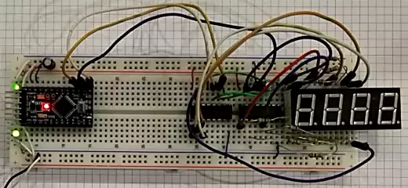

# HAPPY NEW YEAR

This repo is for a little [Arduino](https://adruino.cc) project to congratulate the new Persian year on behalf of [CACTB](https://t.me/cactb). 

## The circuit

An Arduino board shifts seven segment bit patterns to 2 daisy-chained shift registers. One seven segment lights up at a time. By sequentially turning every seven segment on it looks like they are all on all the time (multiplexing).